# SISP Protocol Code Review and Implementation Guide

## Scope
This document explains the implemented protocol layer and state machine behavior.
It intentionally excludes SVD algorithm internals and correction estimation math details.
Those will be implemented in dedicated modules later.

## High-level Goal
The C++ protocol stack provides:
1. A compact wire header with checksum.
2. Typed payload serialization and parsing for each protocol service.
3. A deterministic state machine for correction, relay, and borrow workflows.
4. Test coverage for codec round-trips and state transitions.

## File-by-file Intent
- include/sisp_protocol.hpp
  - Defines protocol constants, service codes, packet layout, payload types, and codec function signatures.
- src/sisp_protocol.cpp
  - Implements CRC-8/MAXIM, service name lookup, DEGR computation, and all payload codecs.
- include/sisp_encoder.hpp + src/sisp_encoder.cpp
  - Packs header fields into the 5-byte protocol header and appends payload/security prefix.
- include/sisp_decoder.hpp + src/sisp_decoder.cpp
  - Unpacks header fields, validates checksum/security placeholder, extracts payload bytes.
- include/sisp_state_machine.hpp + src/sisp_state_machine.cpp
  - Defines state/event enums, context, transition table, and action handlers.
  - Actions parse payloads and store protocol-level context snapshots.
- include/sim_hooks.hpp + src/sim_hooks.cpp
  - C ABI surface for simulation integration.

## DEGR Computation (Protocol-level)
Implemented in src/sisp_protocol.cpp.

Design used now:
1. k-factor contribution is binary:
   - |k-1| <= 0.10 => 0
   - |k-1| > 0.10 => 5/// wrong its like svd 
2. SVD residual contribution is bucketed 0..5:
   - (0.00, 0.20] => 1
   - (0.20, 0.40] => 2
   - (0.40, 0.60] => 3
   - (0.60, 0.80] => 4
   - (0.80, +inf) => 5
3. Age contribution is 0..3 by mission year buckets.
4. Orbit error contribution is 0..2 by 250 m and 500 m thresholds.
5. Final DEGR = clamp(k + svd + age + orbit, 0..15).

No fminf scaling is used in this model.

## Typed Payload Codec Rules
All integer fields are serialized as big-endian.
Float payload values are copied as IEEE-754 binary32 bytes (memcpy).

Implemented payload codecs:
- CorrectionReq
- CorrectionRsp
- RelayReq
- RelayDecision
- DownlinkData
- DownlinkAck
- Status
- Heartbeat
- Failure
- BorrowReq
- BorrowDecision

## Cleaner State Machine Graph

```mermaid
stateDiagram-v2
    [*] --> IDLE

    state "Correction" as CORR {
        CORR_WAIT_RSP --> CORR_COLLECTING: RX_CORRECTION_RSP
        CORR_WAIT_RSP --> CORR_COMPUTING: TIMER_EXPIRED
        CORR_COLLECTING --> CORR_COLLECTING: RX_CORRECTION_RSP
        CORR_COLLECTING --> CORR_COMPUTING: TIMER_EXPIRED
        CORR_COMPUTING --> CORR_DONE: CORRECTION_DONE
        CORR_DONE --> IDLE
    }

    state "Relay Requester" as RREQ {
        RELAY_WAIT_ACCEPT --> RELAY_SENDING: RX_RELAY_ACCEPT
        RELAY_WAIT_ACCEPT --> IDLE: RX_RELAY_REJECT
        RELAY_WAIT_ACCEPT --> RELAY_WAIT_ACCEPT: TIMER_EXPIRED
        RELAY_SENDING --> RELAY_WAIT_ACK: ALL_FRAGS_SENT
        RELAY_WAIT_ACK --> RELAY_DONE: RX_DOWNLINK_ACK
        RELAY_WAIT_ACK --> RELAY_WAIT_ACCEPT: TIMER_EXPIRED
        RELAY_DONE --> IDLE
    }

    state "Relay Provider" as RPROV {
        RELAY_RECEIVING --> RELAY_STORING: RX_DOWNLINK_DATA
        RELAY_STORING --> RELAY_DOWNLINKING: ALL_FRAGS_RCVD
        RELAY_DOWNLINKING --> IDLE: SENSOR_READ_DONE
    }

    state "Borrow Provider" as BPROV {
        BORROW_SAMPLING --> BORROW_SENDING: SENSOR_READ_DONE
        BORROW_SENDING --> BORROW_DONE: ALL_FRAGS_SENT
        BORROW_DONE --> IDLE
    }

    IDLE --> CORR_WAIT_RSP: FAULT_DETECTED
    IDLE --> CORR_RESPONDING: RX_CORRECTION_REQ
    CORR_RESPONDING --> IDLE: SENSOR_READ_DONE

    IDLE --> RELAY_WAIT_ACCEPT: ENERGY_LOW or GS_LOST
    IDLE --> RELAY_RECEIVING: RX_RELAY_REQ
    IDLE --> BORROW_SAMPLING: RX_BORROW_REQ

    IDLE --> IDLE: RX_STATUS_BROADCAST / RX_HEARTBEAT
    IDLE --> CRITICAL_FAIL: CRITICAL_FAILURE

    CORR_WAIT_RSP --> IDLE: RESET
    CORR_COLLECTING --> IDLE: RESET
    RELAY_SENDING --> IDLE: RESET
    RELAY_RECEIVING --> IDLE: RESET
    RELAY_STORING --> IDLE: RESET
    BORROW_SAMPLING --> IDLE: RESET
    BORROW_SENDING --> IDLE: RESET
```

## Current Responsibilities of State Actions
Implemented actions currently do protocol-level work:
- Parse typed payloads from incoming packets.
- Update context snapshots (last_correction_rsp, last_relay_req, last_borrow_req, etc.).
- Advance state according to transition table.

Not implemented yet (intentionally deferred):
- Sensor fusion or Kalman update internals.
- SVD detector internals.
- Real radio/ground transport IO.

## Test Coverage Summary
- tests/test_encode_decode.cpp
  - Header packing/unpacking, checksum, and packet round-trips.
- tests/test_payload_codec.cpp
  - Typed payload serializer/parser round-trips for all protocol payloads.
- tests/test_state_machine.cpp
  - Correction, relay, borrow transition and parse-storage checks.
- tests/test_degr.cpp
  - DEGR thresholds, clamping, and bucket behavior.

## Next protocol-focused steps
1. Enforce per-service payload length validation in the decoder pipeline.
2. Add duplicate sequence detection and address filtering policy tests.
3. Add explicit relay fragment window/accounting checks in context.
